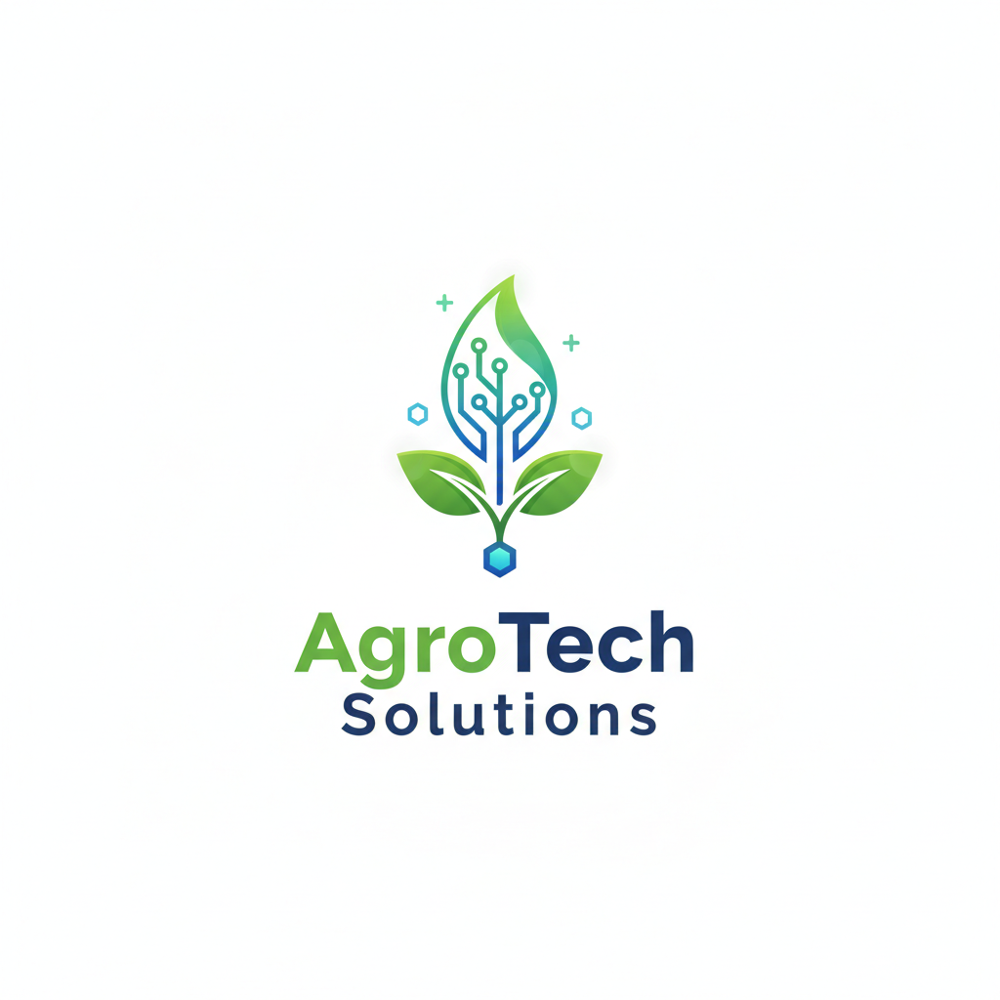

# Proyecto 1: Diseño de la Transformación Digital de un Sector usando IA

## Introducción al Proyecto

Bienvenido al repositorio del proyecto de transformación digital para **AgroTech Solutions**.

Este trabajo aborda el diseño de una arquitectura tecnológica integral que unifica los entornos de **Planta (OT)** y **Negocio (IT)**. A través de la implementación de Inteligencia Artificial, Visión por Computador y Big Data, se busca resolver los problemas de desconexión entre la producción y la demanda, mejorando la competitividad y sostenibilidad de la empresa en el sector agroalimentario.

El proyecto cubre desde el análisis de la empresa y la selección de tecnologías, hasta el diseño de la arquitectura de datos y la reflexión sobre el futuro del sector.

---

##  Índice de Contenidos

Navega a través de los diferentes módulos del proyecto haciendo clic en los enlaces a continuación:

### [1. Ficha de la Empresa y Contexto ](ficha_empresa.md)
* Perfil corporativo de AgroTech Solutions, características del sector y definición del problema ("Pain Point") a resolver.

### [2. Selección de Tecnologías (IT/OT) ](listado_tecnologias.md)
* Justificación detallada de las tecnologías seleccionadas para Planta (Visión Artificial, IIoT) y Negocio (Forecasting, RPA).

### [3. Diagrama de Arquitectura y Estructura ](diagrama_mermaid.md)
* Visualización gráfica del flujo de datos y explicación de la convergencia IT/OT y el impacto organizacional.

### [4. Propuesta de Valor y Transformación Digital ](propuesta_transformacion_digital.md)
* Detalle de las ventajas operativas (Eficiencia, JIT) y competitivas (Trazabilidad, Agilidad) de la propuesta.

### [5. Reflexión Final: Impacto de la IA ](reflexion_final.md)
* Visión sobre la importancia presente y futura de la IA, comparativa con otros sectores (Automoción/Banca) y el futuro de la seguridad alimentaria.

---

*Proyecto realizado por: [Manuel Amado, Pablo Reyes, Fran Falcón y Daniel Espinosa]*
*Fecha: Noviembre 2025*

