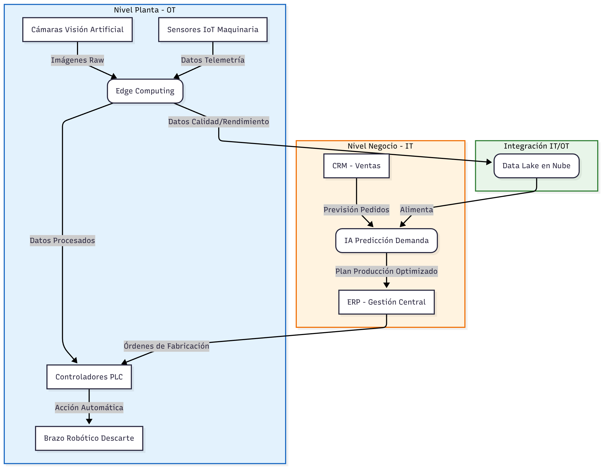

## Estructura IT/OT y Convergencia

### Análisis de la Relación IT/OT
Para alcanzar la calificación de excelencia, es vital entender que la transformación no es solo instalar tecnología, sino conectar dos mundos:

1.  **Flujo Ascendente (OT hacia IT):** La planta deja de ser una "caja negra". Los datos de producción real, mermas y tiempos de parada (OT) fluyen hacia el ERP (IT) en tiempo real. Esto permite a la dirección financiera conocer el coste exacto de cada lote producido al instante.
2.  **Flujo Descendente (IT hacia OT):** Las predicciones de ventas (IT) se convierten automáticamente en Órdenes de Fabricación que se envían a los PLC de las máquinas (OT), ajustando la velocidad de línea o los turnos de trabajo sin intervención manual.

### Impacto Organizacional y Cultural
La implementación de esta arquitectura provoca un cambio profundo en el organigrama:
* **Reskilling (Reciclaje profesional):** Los operarios de línea evolucionan a "supervisores de procesos digitales". Ya no inspeccionan la verdura, inspeccionan que la IA esté funcionando bien.
* **Toma de decisiones:** Se elimina la "intuición" de los jefes de planta. Las decisiones sobre qué producir y cuándo mantener una máquina se basan puramente en datos objetivos (Data-Driven Decision Making).
